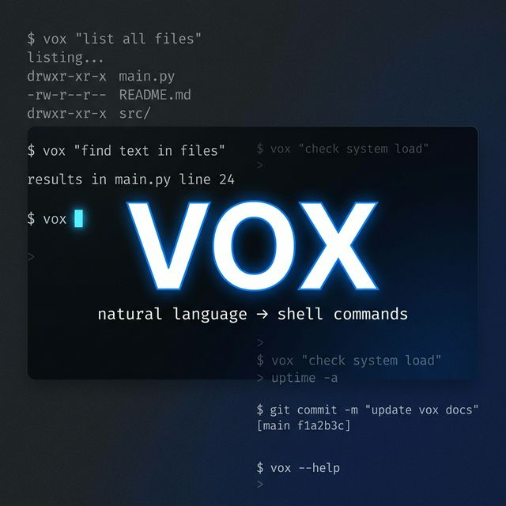

<p align="center">
  
</p>

<h1 align="center">vox</h1>

<p align="center">
  <strong>Natural language → shell commands, straight from your terminal.</strong>
</p>

<p align="center">
  <a href="https://vox.almaas.workers.dev/"></a>
  <a href="#"></a>
  <a href="#"></a>
  <a href="LICENSE"></a>
</p>

<p align="center">
  Type what you want in plain English. Get back the exact shell command.<br/>
  No installs. No API keys on your end. Just <code>curl</code>.
</p>

---

## ⚡ Quick Start

```bash
curl "https://vox.almaas.workers.dev/list all files"
```

That's it. You get back:

```
ls -la
```

---

## 🧠 How It Works

```
┌──────────────┐      ┌───────────────────┐      ┌──────────────┐
│  Your        │ curl │  Cloudflare        │ API  │  Groq        │
│  Terminal    │─────▶│  Worker (vox)      │─────▶│  LLaMA 3.3   │
│              │◀─────│                    │◀─────│  70B          │
└──────────────┘  cmd └───────────────────┘  cmd └──────────────┘
                         │
                         ├─ Reads User-Agent header
                         ├─ Detects your OS & shell
                         └─ Tailors the command for
                            your exact system
```

1. You `curl` the API with a natural language query as the URL path
2. The worker reads your `User-Agent` header to detect your OS and shell
3. Sends both the query and system context to **Groq's LLaMA 3.3 70B** model
4. Returns the raw shell command — no markdown, no wrappers, just the command

---

## 📚 Examples

### File Operations

```bash
# List all files including hidden ones
curl "https://vox.almaas.workers.dev/list all files including hidden"
# → ls -la

# Find all Python files modified in the last 24 hours
curl "https://vox.almaas.workers.dev/find python files modified today"
# → find . -name "*.py" -mtime -1

# Count lines of code in all JavaScript files
curl "https://vox.almaas.workers.dev/count lines of code in all js files"
# → find . -name "*.js" -exec wc -l {} + | tail -1
```

### Compression & Archives

```bash
# Compress current folder to tar.gz
curl "https://vox.almaas.workers.dev/compress this folder to tar.gz"
# → tar -czvf archive.tar.gz .

# Extract a zip file
curl "https://vox.almaas.workers.dev/extract archive.zip"
# → unzip archive.zip
```

### System & Processes

```bash
# Show disk usage sorted by size
curl "https://vox.almaas.workers.dev/show disk usage sorted by size"
# → du -sh * | sort -rh

# Kill the process running on port 3000
curl "https://vox.almaas.workers.dev/kill process on port 3000"
# → fuser -k 3000/tcp

# Show top 10 memory-consuming processes
curl "https://vox.almaas.workers.dev/top 10 processes by memory usage"
# → ps aux --sort=-%mem | head -11
```

### Networking

```bash
# Check if a website is reachable
curl "https://vox.almaas.workers.dev/check if google.com is reachable"
# → ping -c 4 google.com

# Show all open ports
curl "https://vox.almaas.workers.dev/show all open ports"
# → ss -tuln

# Download a file from a URL
curl "https://vox.almaas.workers.dev/download https://example.com/file.zip"
# → wget https://example.com/file.zip
```

### Git

```bash
# Undo the last commit but keep changes
curl "https://vox.almaas.workers.dev/undo last git commit keep changes"
# → git reset --soft HEAD~1

# Show commit log as a one-line graph
curl "https://vox.almaas.workers.dev/git log as one line graph"
# → git log --oneline --graph --all
```

### Text & Data

```bash
# Find the word "error" in all log files
curl "https://vox.almaas.workers.dev/find error in all log files"
# → grep -r "error" *.log

# Replace "foo" with "bar" in all text files
curl "https://vox.almaas.workers.dev/replace foo with bar in all txt files"
# → sed -i 's/foo/bar/g' *.txt

# Sort a CSV file by the second column
curl "https://vox.almaas.workers.dev/sort data.csv by second column"
# → sort -t',' -k2 data.csv
```

---

## 🖥️ Auto System Detection

Vox reads the `User-Agent` header from your request and automatically tailors commands for your system. **No configuration needed.**

| Detected System   | Shell      | Example Command Style           |
|:-------------------|:-----------|:---------------------------------|
| **Windows**        | PowerShell | `Get-ChildItem -Recurse`        |
| **Windows** (CMD)  | cmd        | `dir /s`                        |
| **macOS**          | zsh        | `ls -la`                        |
| **Ubuntu**         | bash       | `apt install ...`               |
| **Fedora**         | bash       | `dnf install ...`               |
| **Arch Linux**     | bash       | `pacman -S ...`                 |
| **Alpine Linux**   | ash        | `apk add ...`                   |
| **Kali Linux**     | bash       | `apt install ...`               |
| **Android** (Termux) | bash    | `pkg install ...`               |
| **Debian** (default) | bash    | `apt install ...`               |

> If the User-Agent can't be identified, vox defaults to **Debian / bash**.

### Check What Was Detected

Every response includes an `X-Detected-System` header:

```bash
curl -v "https://vox.almaas.workers.dev/list all files" 2>&1 | grep X-Detected
# → < X-Detected-System: Debian (bash)
```

---

## 🔧 Execute Directly

Pipe the output directly into your shell to run commands instantly:

```bash
# ⚠️  Review the command first — always know what you're running!
curl -s "https://vox.almaas.workers.dev/list all files" | sh
```

Or use it as a shell function (add to your `.bashrc` / `.zshrc`):

```bash
vox() {
  local cmd
  cmd=$(curl -s "https://vox.almaas.workers.dev/$*")
  echo "→ $cmd"
  read -p "Run? [y/N] " confirm
  [[ "$confirm" =~ ^[Yy]$ ]] && eval "$cmd"
}
```

**PowerShell** equivalent (add to your `$PROFILE`):

```powershell
function vox {
  $query = ($args -join ' ')
  $cmd = Invoke-RestMethod "https://vox.almaas.workers.dev/$query"
  Write-Host "→ $cmd" -ForegroundColor Cyan
  $confirm = Read-Host "Run? [y/N]"
  if ($confirm -match '^[Yy]$') { Invoke-Expression $cmd }
}
```

Then just:

```bash
vox show disk usage sorted by size
# → du -sh * | sort -rh
# Run? [y/N]
```

---

## 🏗️ Self-Hosting

### Prerequisites

- [Node.js](https://nodejs.org/) (v18+)
- A [Cloudflare](https://cloudflare.com) account
- A [Groq](https://console.groq.com) API key

### Setup

```bash
# Clone the repo
git clone https://github.com/almas-cp/vox.git
cd vox

# Install dependencies
npm install

# Set your Groq API key as a secret
npx wrangler secret put GROQ_API_KEY

# Deploy
npm run deploy
```

### Local Development

```bash
# Start local dev server
npm run dev

# Test it
curl "http://localhost:8787/list all files"
```

---

## 📁 Project Structure

```
vox/
├── src/
│   └── index.js        # Worker entry — detection, prompt, API call
├── .github/
│   └── banner.png      # Repo banner
├── package.json
├── wrangler.toml       # Cloudflare Worker config
└── README.md
```

---

## ⚙️ Tech Stack

| Component       | Technology                                                       |
|:----------------|:------------------------------------------------------------------|
| **Runtime**     | [Cloudflare Workers](https://workers.cloudflare.com/)            |
| **AI Model**    | [LLaMA 3.3 70B](https://groq.com/) via Groq                    |
| **Language**    | JavaScript (ES Modules)                                          |
| **Deployment**  | [Wrangler CLI](https://developers.cloudflare.com/workers/wrangler/) |

---

## 📄 License

MIT © [almas-cp](https://github.com/almas-cp)
